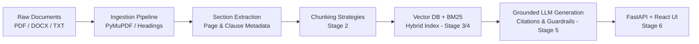

# BFSI Policy Research Assistant (RAG)

An enterprise-grade, grounded retrieval-augmented generation (RAG) system for Indian Banking, Financial Services, and Insurance (BFSI) regulatory documents (RBI circulars, Master Directions, payment security frameworks, and internal banking SOPs).

---

## Architecture Overview



---

## Key Features (Phase 1 Roadmap)

- **Stage 1 (Completed):** Project skeleton, Pydantic settings, PyMuPDF parser, section segmentation, regulatory metadata extraction, and idempotent CLI ingestion.
- **Stage 2 (Next):** Configurable chunking strategies (Fixed, Recursive, Structure-Aware) with decision doc `001-chunking.md`.
- **Stage 3:** Pluggable embeddings and Vector Store (Qdrant) with duplicate deduplication.
- **Stage 4:** Hybrid search (Dense Vector + BM25 Reciprocal Rank Fusion) and Cross-Encoder reranking.
- **Stage 5:** Grounded generation with strict multi-attribute citations and hallucination mitigation.
- **Stage 6:** FastAPI endpoints and React (Vite) citation inspection UI.
- **Stage 7:** Golden evaluation benchmark (Recall@k, MRR, Hit Rate).
- **Stage 8:** Production hardening, Docker Compose, and BFSI architectural notes.

---

## Quickstart (Stage 1)

### 1. Environment Setup

```bash
# Clone and enter project directory
cd new-project

# Activate virtual environment
.venv\Scripts\activate   # On Windows
# source .venv/bin/activate  # On Linux/macOS

# Install dependencies
pip install -r requirements.txt
```

### 2. Ingest Sample Documents

```bash
# Ingest synthetic test dataset
python scripts/ingest.py --input-dir data/synthetic
```

To ingest real RBI documents:
1. Follow instructions in [`data/raw/README.md`](data/raw/README.md) to download official PDFs from [rbi.org.in](https://www.rbi.org.in).
2. Place them in `data/raw/`.
3. Run:
```bash
python scripts/ingest.py --input-dir data/raw
```

### 3. Run Test Suite

```bash
pytest -v
```

---

## Project Structure

```
new-project/
├── config/
│   └── settings.py          # Pydantic Settings (ENV-driven)
├── data/
│   ├── raw/                 # Public RBI circulars (see data/raw/README.md)
│   ├── synthetic/           # Test datasets for automated tests
│   └── processed/           # Parsed JSON manifests and documents
├── docs/
│   └── decisions/           # Architectural decision records
├── scripts/
│   └── ingest.py            # CLI document ingestion tool
├── src/
│   ├── core/
│   │   ├── logging.py       # Standardized structured logging
│   │   └── models.py        # Pydantic domain models (Document, Section, etc.)
│   └── ingestion/
│       ├── parser_base.py   # Abstract parser base class
│       ├── pdf_parser.py    # PyMuPDF parser with regex metadata extraction
│       ├── docx_parser.py   # python-docx parser for SOPs
│       ├── text_parser.py   # Markdown & TXT parser
│       └── pipeline.py      # Idempotent ingestion orchestrator
├── tests/
│   └── test_ingestion.py    # Unit & integration tests
├── .env.example
├── pytest.ini
├── requirements.txt
└── README.md
```
